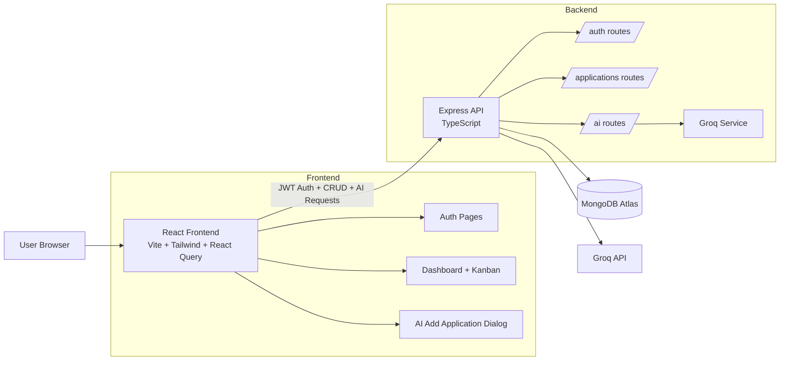

# AI Job Navigator

Full-stack internship assignment project for tracking job applications with AI-assisted job description parsing.

## Assignment Coverage

- User authentication with JWT and bcrypt
- Protected app experience with session persistence
- Kanban pipeline with required stages: Applied, Phone Screen, Interview, Offer, Rejected
- Applications CRUD (create, read, update, delete)
- AI parsing of pasted job descriptions into structured fields
- AI-generated resume bullet suggestions
- Drag and drop stage updates
- Search, filters, and dashboard stats
- Optional enhancements: streaming AI parse feedback, reminders/overdue highlighting, CSV export

## Architecture Diagram

## Tech Stack

- Frontend: React, TypeScript, Vite, Tailwind CSS, shadcn UI, React Query
- Backend: Node.js, Express, TypeScript, Mongoose
- Database: MongoDB Atlas
- Authentication: JWT, bcryptjs
- AI: Groq API (OpenAI-compatible Chat Completions format)

## AI Provider Note

This project uses Groq instead of OpenAI directly due budget constraints for API usage.
The implementation still follows the same structured JSON-output approach required by the assignment via an OpenAI-compatible API format.

## Environment Variables

Copy .env.example to .env and set:

- VITE_API_BASE_URL
- NODE_ENV
- SERVER_PORT
- CLIENT_ORIGIN
- MONGODB_URI
- JWT_SECRET
- JWT_EXPIRES_IN
- GROQ_API_KEY
- GROQ_MODEL

## Run Locally

1. Install dependencies:

	npm install

2. Start development server:

	npm run dev:full

3. Open application:

	http://localhost:8080

## API Overview

- Auth: POST /api/auth/register, POST /api/auth/login, GET /api/auth/me
- Applications: GET /api/applications, POST /api/applications, GET /api/applications/:id, PUT /api/applications/:id, PATCH /api/applications/:id/status, DELETE /api/applications/:id
- AI: POST /api/ai/parse-jd, POST /api/ai/parse-jd/stream
- Health: GET /api/health

## Engineering Decisions

- AI logic is isolated in a backend service layer to keep route handlers thin.
- Strict input and output validation is handled with zod for safer runtime behavior.
- Auth is JWT-based with backend and frontend route protection plus persisted login.
- React Query is used for API state, loading/error handling, and cache invalidation.
- Defensive parsing handles non-ideal AI payload shapes to avoid frontend crashes.
